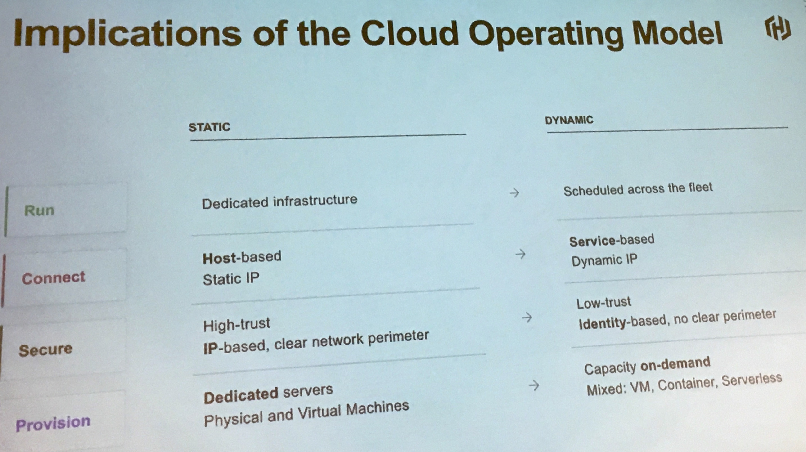
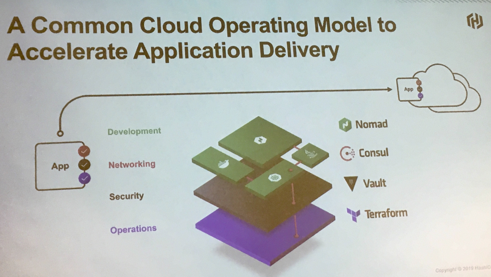
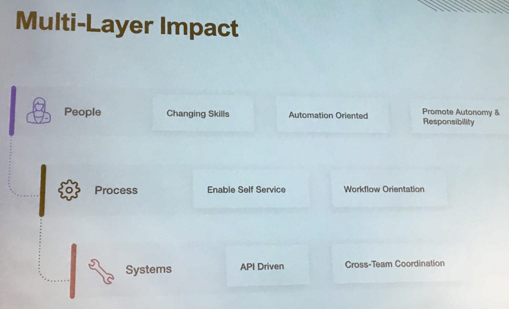
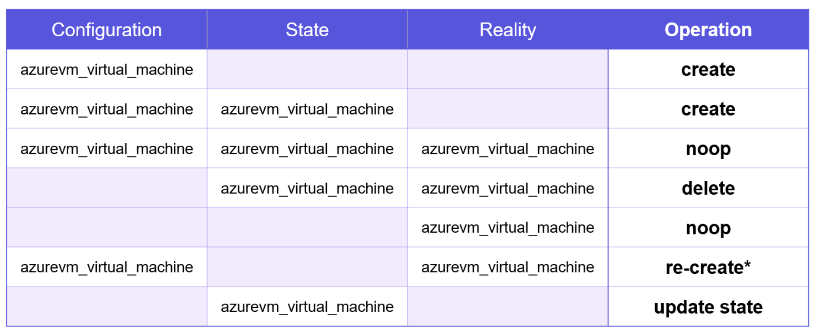

# Terraform workshop

## Cloud operating workshop
* Tradition datacenter (Static) to modern datacenter (Dynamic)
* This is how it looks like:

* Different Hashicorp products (which helps the multi-cloud strategy)
    - Terraform (Infrastructure as code)
    - Vault (Secrets management)
    - Consul (Service discovery)
    - Nomad (Deployment tooling)
* This is how the different products sit together:

* If done correctly, this is how the orgnisation can/shall look like:


## Hands-on session

### Intro
* Starting point: https://hashicorp.github.io/workshops/
* Slides: https://hashicorp.github.io/workshops/azure/terraform/#1 
* Here are some of the 'as-a-service' options look like:

    | Product | Style |
    | --- | --- |
    | AWS | IaaS |
    | GCP | IaaS |
    | Azure | IaaS |
    |Heroku | PaaS |
    | Datadog | SaaS |

### Provisioning VMs
Assuming you are using Azure, these are 3 ways to provision VMs:
1. Azure Portal (GUI)
2. Azure Resource Manager (ARM) Template 
3. Provision with Terraform

### Key aspects of Terraform
* Terraform is idempotent 
* Terraform works across different cloud providers (supported by all 3 - AWS, Azure, GCP)
* Terraform lets you 'dry run' your changes

### Chapter 1:
1. Log into the Windows workstation (credentials provided by HashiCorp)
2.  Run the powershell script
```bash
# Fetch dynamic Azure credentials for the workshop.
# Uses https://cam-vault.hashidemos.io:8200 and the Sales/SE namespace
# Customize the service principal and account settings to use in a different account

# Fix git line ending settings on Windows
Set-Content -Path 'C:\Users\hashicorp\.gitconfig' -Value "[core]`n        autocrlf = false"

$VAULT_TOKEN = $env:SETUP_VAULT_TOKEN
$VAULT_ADDR = $env:SETUP_VAULT_ADDR

Write-Host -ForegroundColor Magenta "Fetching dynamic Azure credentials from HashiCorp Vault..."

$CREDS=(Invoke-RestMethod -Headers @{"X-Vault-Token" = ${VAULT_TOKEN}; "X-Vault-Namespace" = "Sales/SE"} -Method GET -Uri ${VAULT_ADDR}/v1/azure/creds/se-training-workstation).data

# write-host $CREDS
$CLIENT_ID=$CREDS.client_id
$CLIENT_SECRET=$CREDS.client_secret

Do {
    Write-Host -ForegroundColor White "Waiting for Azure credentials to be ready..."
    Start-Sleep 3
} Until (az login --service-principal -u 91299f64-f951-4462-8e97-9efb1d215501 -p $CLIENT_SECRET --tenant $env:ARM_TENANT_ID --allow-no-subscription 2> $null)

Write-Host -ForegroundColor Yellow "Storing credentials as system environment variables..."

[Environment]::SetEnvironmentVariable("ARM_SUBSCRIPTION_ID", "14692f20-9428-451b-8298-102ed4e39c2a", "Machine")
[Environment]::SetEnvironmentVariable("ARM_TENANT_ID", "0e3e2e88-8caf-41ca-b4da-e3b33b6c52ec", "Machine")
[Environment]::SetEnvironmentVariable("ARM_CLIENT_ID", "${CLIENT_ID}", "Machine")
[Environment]::SetEnvironmentVariable("ARM_CLIENT_SECRET", "${CLIENT_SECRET}", "Machine")

Write-Host -ForegroundColor DarkGreen "Dynamic credentials are good for 8 hours. You may proceed with the workshop."

# This is just for fun
Get-Content -Path C:\Users\Public\banner.txt

Read-Host -Prompt "Press Enter to Continue..."
```
3. Install Terraform extension for VS Code
4. Clone the training repo
```bash
cd ~/Desktop
git clone https://github.com/hashicorp/workshops
cd workshops/azure
code -r .
```
5. The main logic is here: [main.tf](src/main.tf)
6. Check the terraform version
```bash
 terraform --version
```

### Chapter 2:
1. Use the terraform init command
```bash
terraform init
```
2. Run the terraform plan command
```bash
terraform plan
```
This will give an ouput similar to this:
```bash
 # azurerm_resource_group.hashitraining will be created
  + resource "azurerm_resource_group" "hashitraining" {
      + id       = (known after apply)
      + location = "centralus"
      + name     = "kaushik-workshop"
      + tags     = (known after apply)
    }
```

3. Learn about variables - using the terraform.tfvars file (in conjuctinon with variables.tf)
4. Set our location and prefix - This will look like this:
```
prefix = "kaushik"
location = "uksouth"
```

### Chapter 3:
1. Terraform apply -auto-approve
```bash
terraform apply
```
This will give an output like:
```bash
azurerm_resource_group.hashitraining: Creating...
azurerm_resource_group.hashitraining: Creation complete after 10s [id=/subscriptions/14692f20-9428-451b-8298-102ed4e39c2a/resourceGroups/kaushik-workshop]

Apply complete! Resources: 1 added, 0 changed, 0 destroyed.
```
2. Terraform destroy - This will remove all resources
```
terraform destroy
```
3. Adding tags - This will add a tag
```bash
resource "azurerm_resource_group" "hashitraining" {
  name     = "${var.prefix}-workshop"
  location = "${var.location}"

  tags = {
    environment = "Production"
  }
}
```
4. Add a Virtual Network
```bash
resource "azurerm_virtual_network" "vnet" {
  name                = "${var.prefix}-vnet"
  location            = "${azurerm_resource_group.hashitraining.location}"
  address_space       = ["${var.address_space}"]
  resource_group_name = "${azurerm_resource_group.hashitraining.name}"
}
``` 
5. Add a subnet
```bash
resource "azurerm_subnet" "subnet" {
  name                 = "${var.prefix}-subnet"
  virtual_network_name = "${azurerm_virtual_network.vnet.name}"
  resource_group_name  = "${azurerm_resource_group.hashitraining.name}"
  address_prefix       = "${var.subnet_prefix}"
}
```
5. Seeing the terraform graph visually: https://github.com/28mm/blast-radius

### Chapter 4:
1. Understand main.tf, variables.tf and outputs.tf
2. Enabled some outputs in our code
3. Refactor our main.tf into smaller parts
4. Learn the terraform fmt command
```bash
terraform fmt
```

### Chapter 5
1. Learn about Terraform Provisioners
2. Explore the file and remote-exec provisioners
3. Learn the terraform fmt command
4. Used the terraform taint command
5. Rebuilt our web server with a new provisioning step

### Dealing with config, state and reality
* This picture shows the actions that Terraform takes for these different scenarios:



### Other resources
* HashiCorp Learning Portal: https://learn.hashicorp.com/terraform/
* Microsoft Terraform Quickstarts: https://docs.microsoft.com/en-us/azure/terraform/
* Terraform with Azure Cloudshell: https://docs.microsoft.com/en-us/azure/terraform/terraform-cloud-shell
* Terraform Azurerm Provider Documentation: https://www.terraform.io/docs/providers/azurerm/
* Link to the Slide Deck: https://bit.ly/hashiazure

## Notes / Open-questions:
* Putting a load balancer in front of the micro-services - not a good idea! **Why?**

