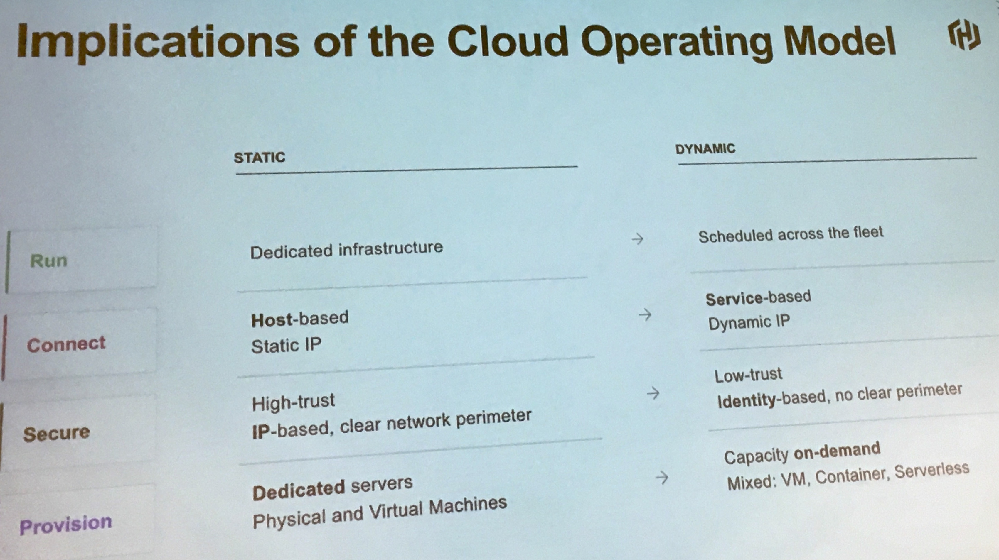
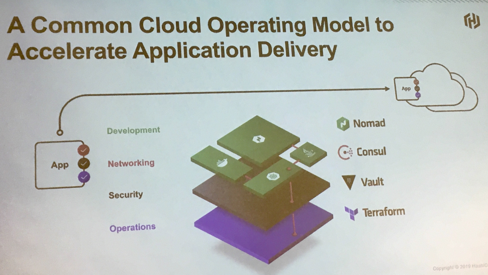
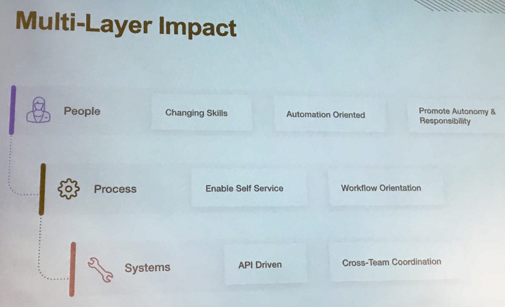

# Terraform workshop

## Cloud operating workshop
* Tradition datacenter (Static) to modern datacenter (Dynamic)
* This is how it looks like:

* Different Hashicorp products (which helps the multi-cloud strategy)
    - Terraform (Infrastructure as code)
    - Vault (Secrets management)
    - Consul (Service discovery)
    - Nomad (Deployment tooling)
* This is how the different products sit together:

* If done correctly, this is how the orgnisation can/shall look like:

## Hands-on session

### Intro
* Starting point: https://hashicorp.github.io/workshops/
* Slides: https://hashicorp.github.io/workshops/azure/terraform/#1 
* Here are some of the 'as-a-service' options look like:
    | Product | Style |
    | --- | --- |
    | AWS | IaaS |
    | GCP | IaaS |
    | Azure | IaaS |
    |Heroku | PaaS |
    | Datadog | SaaS |

### Provisioning VMs
Assuming you are using Azure, these are 3 ways to provision VMs:
1. Azure Portal (GUI)
2. Azure Resource Manager (ARM) Template 
3. Provision with Terraform

## Notes / Open-questions:
* Putting a load balancer in front of the micro-services - not a good idea! **Why?**

