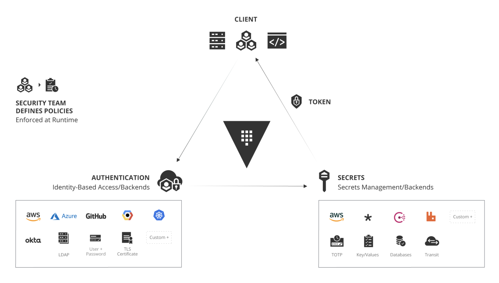
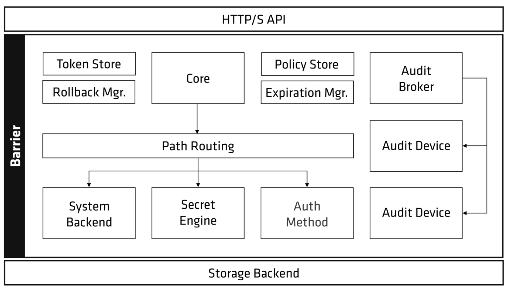
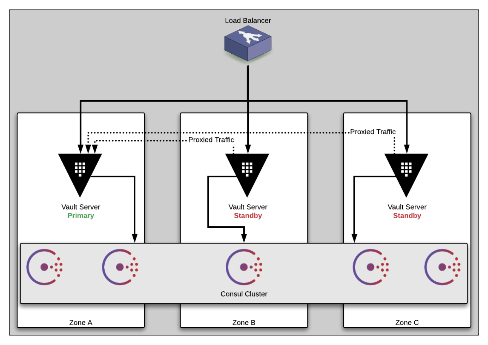
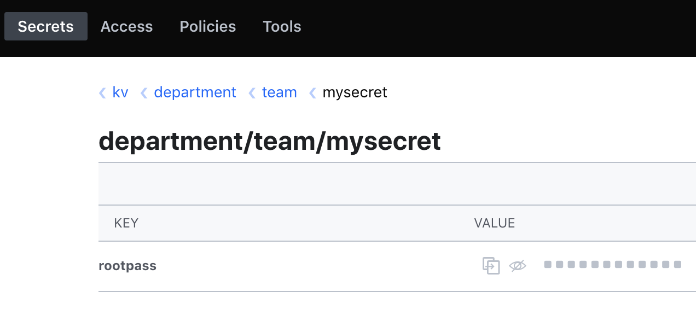
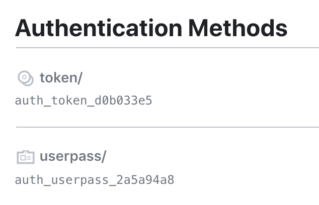
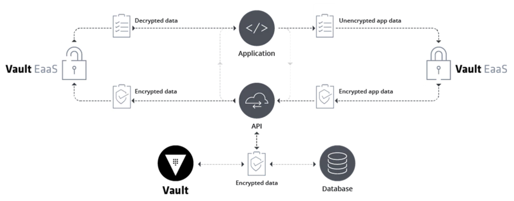

# Vault workshop

### Hands-on session
* Slides: https://hashicorp.github.io/workshops/azure/vault/#1
* High-level architecture for vault looks like this:

(More details here: https://www.hashicorp.com/identity-based-security-and-low-trust-networks)
* Vault internals look like this:

(More details here: https://www.vaultproject.io/docs/internals/architecture.html)
* Vault high availability setup looks like this:

(More details here: https://learn.hashicorp.com/vault/operations/ops-reference-architecture)

### Chapter 2
* Setting up the vault environment using Terraform (this is a continuation from the Terraform session)

### Chapter 3
* Connecting to vault
```bash
terraform output Vault_Server_URL
```
This outputs something like this:
```bash
 http://kaushik.eastus.cloudapp.azure.com:8200
```
* Log into the vault
* Create a new secret (via the UI). For example:

* Get the secret (via SSH). For example:
```bash
hashicorp@kaushik:~$ vault kv get kv/department/team/mysecret
```
This outputs something like this:
```bash
====== Metadata ======
Key              Value
---              -----
created_time     2019-12-04T14:42:47.988736609Z
deletion_time    n/a
destroyed        false
version          1

====== Data ======
Key         Value
---         -----
rootpass    supersecret
```
* Get the secret (via CURL). For example:
```bash
curl --header "X-Vault-Token: root" \
http://localhost:8200/v1/kv/data/department/team/mysecret | jq .data
```
This outputs something like this:
```json
{
  "data": {
    "rootpass": "supersecret"
  },
  "metadata": {
    "created_time": "2019-12-04T14:42:47.988736609Z",
    "deletion_time": "",
    "destroyed": false,
    "version": 1
  }
}
```

### Chapter 4
* This is where we create some ACL policies
* Example of what an ACL policy looks like from the UI is as follows:


### Chapter 5
* Adding the username-password as an Access method. Here is how it looks on the UI:

* One the userpass method is added, we can create different access methods on the SSH-ed machine:
```bash
vault write auth/userpass/users/bob \
    password=foo \
    policies=secret
vault write auth/userpass/users/sally \
    password=foo \
    policies=lob_a
```
* This means that Bob can read, list and create data under the secret/* path because his policy allows him to do so. Vault comes with a key/value engine mounted at secret/ by default. When Sally logs on she can't even see the secret/ path because she does not have list permissions

### Chapter 7
* This covers dynamic secrets
* We first run the following script (Full script is available here: [database_setup.sh](database_setup.sh))
```bash
./database_setup.sh
```
* Next, as an authenticated user, I can run the following command to get creds:
```bash
vault read lob_a/workshop/database/creds/workshop-app
```
This outputs the following:
```bash
Key                Value
---                -----
lease_id           lob_a/workshop/database/creds/workshop-app/95g5sJoyJpa8zbsZduj7ocSk
lease_duration     5m
lease_renewable    true
password           A1a-fIjjcw0hcXwOPdQT
username           v-token-workshop-a-MFVO0aWd8pp4j
```
* Using the newly created credentials to log onto the MySQL database: The script gets new credentials from Vault, logs me onto the database server, then run a `show databases;` command and exit:
* Full script is available here: [mysql_login.sh](mysql_login.sh)
```bash
./mysql_login.sh
```
This outputs the following:
```bash
+--------------------+
| Database           |
+--------------------+
| information_schema |
+--------------------+
```

### Chapter 8
* Vault has an encryption-as-a-service secrets engine called transit. This is how it looks like"

* Run the script to setup transit (Full script is available here: [transit_setup.sh](transit_setup.sh))
* This is exposed here: http://kaushik.eastus.cloudapp.azure.com:5000/
* When you enabled Vault each new record entered into the database has it's PII send through Vault before being written to the database. This greatly reduces the risk of sensitive data being compromised.
* Even if an attacker manages to get access to the database they will only be able to see ciphertext (which is useless without the decryption keys that are safely stored in Vault.)
