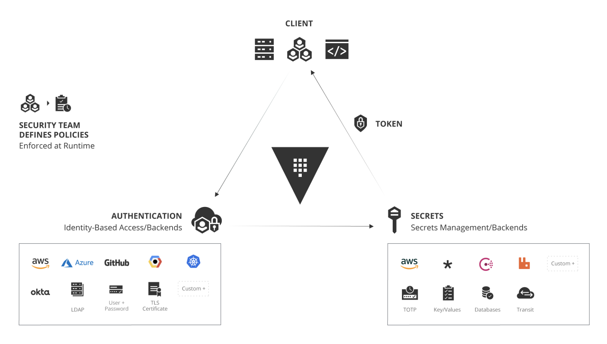
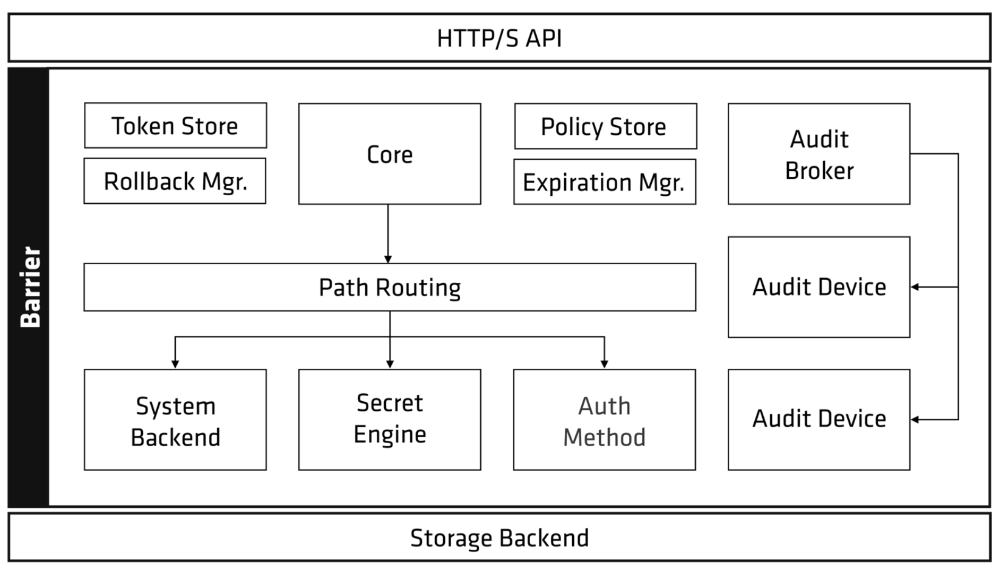
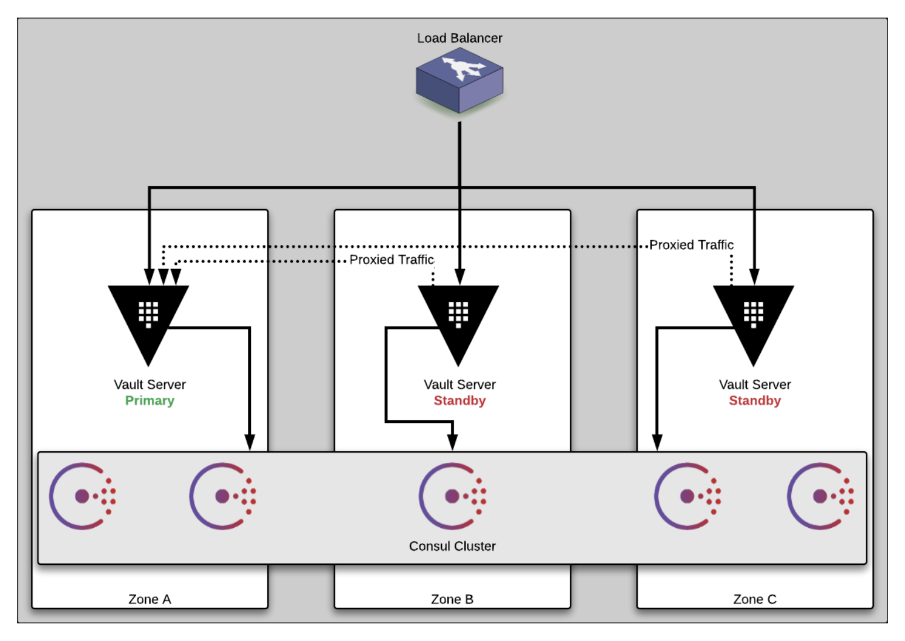
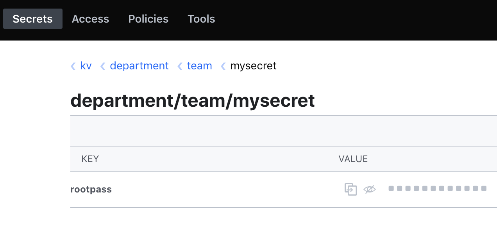

# Vault workshop

### Hands-on session
* Slides: https://hashicorp.github.io/workshops/azure/vault/#1
* High-level architecture for vault looks like this:

(More details here: https://www.hashicorp.com/identity-based-security-and-low-trust-networks)
* Vault internals look like this:

(More details here: https://www.vaultproject.io/docs/internals/architecture.html)
* Vault high availability setup looks like this:

(More details here: https://learn.hashicorp.com/vault/operations/ops-reference-architecture)

### Chapter 2
* Setting up the vault environment using Terraform (this is a continuation from the Terraform session)

### Chapter 3
* Connecting to vault
```bash
terraform output Vault_Server_URL
```
This outputs something like this:
```bash
 http://kaushik.eastus.cloudapp.azure.com:8200
```
* Log into the vault
* Create a new secret (via the UI). For example:

* Get the secret (via SSH). For example:
```bash
hashicorp@kaushik:~$ vault kv get kv/department/team/mysecret
```
This outputs something like this:
```bash
====== Metadata ======
Key              Value
---              -----
created_time     2019-12-04T14:42:47.988736609Z
deletion_time    n/a
destroyed        false
version          1

====== Data ======
Key         Value
---         -----
rootpass    supersecret
```
* Get the secret (via CURL). For example:
```bash
curl --header "X-Vault-Token: root" \
http://localhost:8200/v1/kv/data/department/team/mysecret | jq .data
```
This outputs something like this:
```json
{
  "data": {
    "rootpass": "supersecret"
  },
  "metadata": {
    "created_time": "2019-12-04T14:42:47.988736609Z",
    "deletion_time": "",
    "destroyed": false,
    "version": 1
  }
}
```
